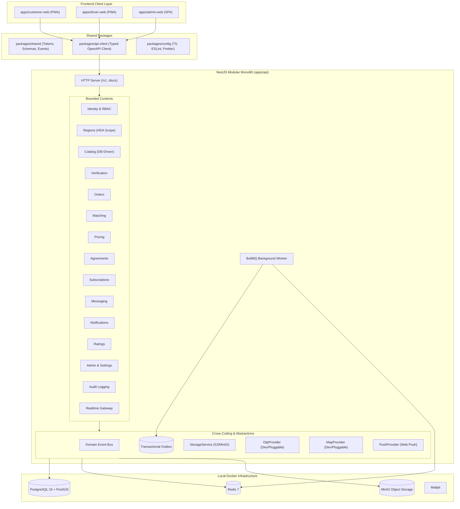
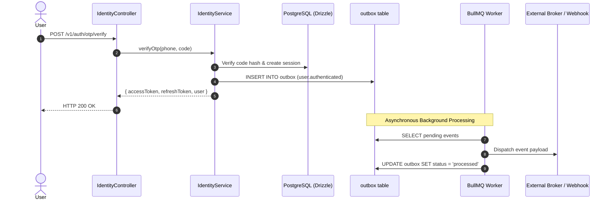

# Wasel Platform — Architecture Guide

## 1. System Architecture Map



---

## 2. Event Flow Architecture (Transactional Outbox)



---

## 3. How to Add a New Bounded Context Module

1. **Create the module directory**:
   `apps/api/src/modules/<module-name>/`
2. **Define the public facade**:
   Create `<module-name>.facade.ts` implementing public query and command methods.
3. **Export only the facade in `index.ts`**:
   Never export internal repositories or internal services. Only export the NestJS Module, Facade, and any public DTOs.
4. **Register in `AppModule`**:
   Add `<ModuleName>Module` to the `imports` array in `apps/api/src/app.module.ts`.
5. **Verify Boundary Rules**:
   Run `pnpm lint` to ensure no internal files from the new module are imported directly by other modules.

---

## 4. How to Add a New Production Provider

Wasel abstracts all external dependencies behind strict interfaces:
- `OtpProvider`: Located at `apps/api/src/common/providers/otp/otp.provider.interface.ts`.
- `MapProvider`: Located at `apps/api/src/common/providers/map/map.provider.interface.ts`.
- `PushProvider`: Located at `apps/api/src/common/providers/push/push.provider.interface.ts`.
- `StorageService`: Located at `apps/api/src/common/storage/storage.interface.ts`.

### Example: Adding a Production WhatsApp OTP Provider
1. Create `apps/api/src/common/providers/otp/whatsapp-otp.provider.ts`:
   ```typescript
   @Injectable()
   export class WhatsAppOtpProvider implements IOtpProvider {
     readonly providerName = 'whatsapp';
     async sendOtp(options: SendOtpOptions): Promise<SendOtpResult> {
       // Call WhatsApp Cloud API or Meta Graph API
       return { success: true, messageId: 'msg_123', provider: 'whatsapp' };
     }
   }
   ```
2. Bind conditionally in `apps/api/src/modules/identity/identity.module.ts` based on `process.env.OTP_PROVIDER`:
   ```typescript
   {
     provide: OTP_PROVIDER_TOKEN,
     useClass: process.env.OTP_PROVIDER === 'whatsapp' ? WhatsAppOtpProvider : DevOtpProvider,
   }
   ```
3. Zero code changes are required in `IdentityService` or any caller!
