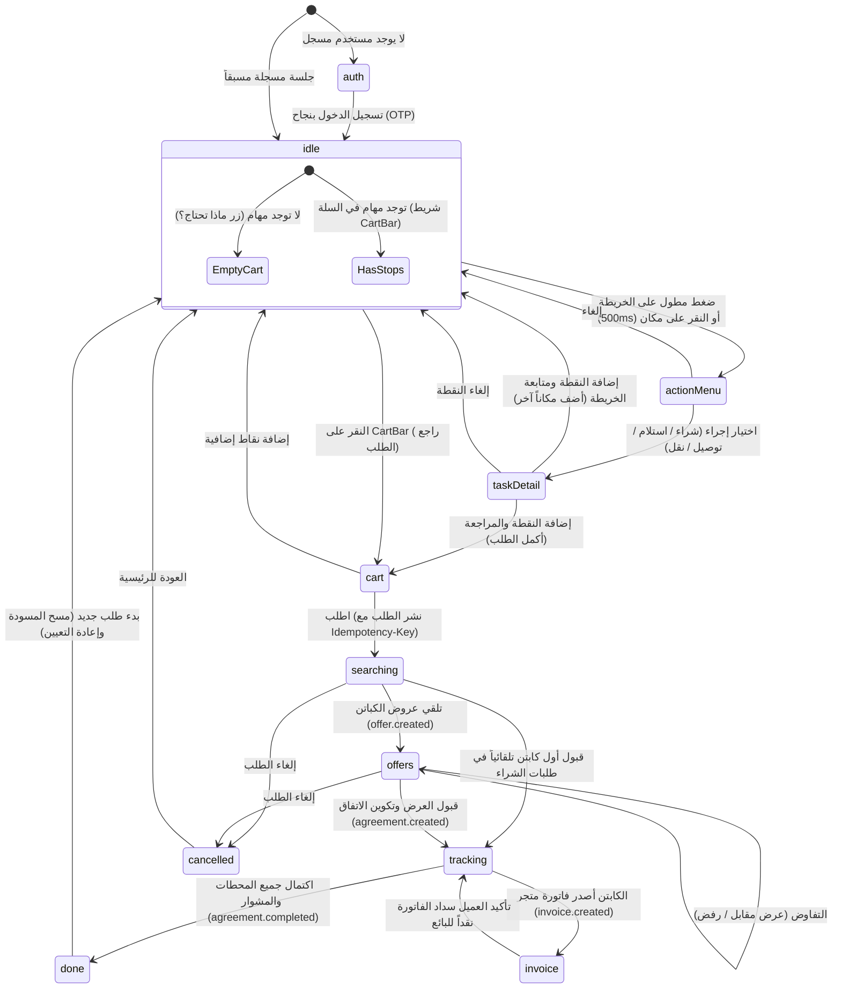

# وثيقة تصميم وتكامل واجهة العميل لمنصة واصل (Customer PWA Architecture & Guide)

توثيق شامل لتصميم وهندسة الواجهة التقدمية للعميل (`apps/customer-web`) لمنصة **واصل** (Wasel) في منطقة حدائق الأهرام، الجيزة، مصر.

---

## 1. فلسفة المنتج وتجربة المستخدم (Product Philosophy & UX Principles)

تعتمد منصة واصل فلسفة **"شاشة واحدة، مهمة واحدة" (One Screen, One Task)**:
- **شاشة الخريطة المستمرة (Single Persistent Map Screen):** لا توجد تنقلات صفحات متعددة أثناء إنشاء أو متابعة الطلب. كل التفاعلات تتم عبر لوحة سفلية ديناميكية (`Bottom Sheet`) تتغير محتوياتها وفق آلة حالات منتهية ومحددة (`Finite State Machine`).
- **زر أساسي واحد لكل حالة (One Primary Action Button):** بارتفاع لا يقل عن `52px` وفي متناول الإبهام دائماً، بعبارات فعلية واضحة ومباشرة: `"اطلب"`، `"اقبل العرض"`، `"أكمل الطلب"`.
- **الواجهة العربية أولاً والاتجاه من اليمين لليسار (Arabic-First RTL):**
  - خط Cairo الأساسي مع Tahoma كبديل احتياطي.
  - رموز وألوان النظام المؤسسية: الحبر الداكن (`ink: #12302b`)، البرتقالي التحفيزي (`accent: #f2a20c`)، الأخضر التوكيدي (`ok: #1f8a5b`)، ولون اللوحة السفلية (`sheet: #ffffff`).
  - التبديل التلقائي بين الوضع الفاتح والداكن (`Light/Dark`).
- **غياب الحوافز المشتتة (Zero Clutter):** إخفاء القائمة الجانبية بالكامل أثناء بناء الطلب لضمان تركيز العميل الكامل على إتمام مهمته.
- **الشفافية دون إرباك (Pricing Transparency without Formulas):** لا تظهر صيغة التسعير للعميل نهائياً، بل يُعرض الحد الأدنى لأجرة الكابتن المسترجعة من الـ API، وعند اكتمال المشوار تُعرض تسوية واضحة من سطرين فقط:
  1. قيمة مشتريات المتاجر (تُدفع للبائع مباشرة).
  2. أجرة الكابتن لتنفيذ المشوار.
- **الصمود على الشبكات الضعيفة (Offline & Weak-Network Resilience):**
  - حفظ مسودة الطلب محلياً في `IndexedDB` مع نسخة احتياطية فورية في `localStorage` لضمان عدم ضياع أي مهمة عند إعادة التحميل أو انقطاع الاتصال.
  - إرسال ترويسة `Idempotency-Key` مع كل عملية طلب لضمان عدم تكرار النشر أو السحب.
  - استئناف أحداث `SSE` تلقائياً عبر `Last-Event-ID`.

---

## 2. آلة الحالات المنتهية للوحة السفلية (Bottom-Sheet Finite State Machine)

تُدار الواجهة السفلية بواسطة مخفض حالات صريح ومحدد (`customerReducer` في `src/machines/customerStateMachine.ts`):



### توصيف الحالات (State Descriptions)

| الحالة `sheetState` | المكون المسؤول | الإجراء الأساسي | التوصيف |
| :--- | :--- | :--- | :--- |
| `idle` | `IdleSheet` / `CartBar` | `"ماذا تحتاج؟"` أو `"راجع الطلب"` | الخريطة التفاعلية، تلميح الضغط المطول، البحث، وشريط السلة العائم. |
| `actionMenu` | `ActionMenuSheet` | اختيار إجراء من القائمة الديناميكية | تفتح عند الضغط المطول (500ms) مع اهتزاز خفيف (Haptic)، مرتبة تلقائياً بحسب نوع النقطة. |
| `taskDetail` | `TaskDetailSheet` | `"أكمل الطلب"` أو `"أضف مكاناً آخر"` | كتابة الملاحظات، تسجيل رسالة صوتية (`MediaRecorder`)، وإرفاق صورة. |
| `cart` | `CartSheet` | `"اطلب"` (نشر فوري) | ترتيب وحذف المهام، شرائح القيمة التقديرية، تبديل وضع الانتظار، وعرض الحد الأدنى للأجرة. |
| `searching` | `SearchingSheet` | رادار البحث النابض + زر إلغاء | الاستماع لأحداث البث الحي `SSE` (`order.updated`, `offer.created`). |
| `offers` | `OffersSheet` | `"قبول"` / `"عرض مقابل"` / `"رفض"` | كروت الكباتن تتضمن الاسم، التقييم، نوع المركبة، وزمن الوصول التقديري. |
| `tracking` | `TrackingSheet` | متابعة المحطات + محادثة + اتصال | خط زمني للمحطات، موقع الكابتن الحي على الخريطة، واعتماد التعديلات اللحظية. |
| `invoice` | `InvoiceSheet` | `"تأكيد السداد للبائع"` أو `"اعتراض"` | عرض صورة وقيمة فاتورة الشراء الصادرة من المتجر لإثبات المعاملة. |
| `done` | `DoneSheet` | `"طلب جديد"` | تسوية الحساب بسطرين (المشتريات + الأجرة)، تقييم الكابتن (1-5 نجوم)، وملاحظات الخدمة. |
| `error` | نافذة الخطأ | زر التعافي المعين | معالجة موحدة لكافة رموز أخطاء الـ API مع رسالة عربية واضحة وإجراء واحد للتعافي. |

---

## 3. عقد طبقة الخرائط الحيادية (MapProvider Contract)

لتفادي الارتباط بأي مزود خرائط مدفوع أو تجاري محدد، تم بناء جميع وظائف الخريطة وفق واجهة تجريدية عامة (`MapProvider`):

```typescript
export interface MapProvider {
  mount(container: HTMLElement, options?: MapProviderOptions): Promise<void>;
  destroy(): void;
  setCenter(coords: Coordinates, zoom?: number): void;
  flyTo(coords: Coordinates, zoom?: number): void;
  addOrUpdateMarker(options: MarkerOptions): void;
  removeMarker(id: string): void;
  clearMarkers(): void;
  setRoute(coordinates: Coordinates[]): void;
  clearRoute(): void;
  onLongPress(callback: (coords: Coordinates) => void): void;
  onMarkerClick(callback: (markerId: string) => void): void;
  reverseGeocode(coords: Coordinates): Promise<string>;
}
```

### المنفذات المعتمدة (Implementations)

1. **`MapLibreProvider` (المزود الإنتاجي الافتراضي):**
   - يعتمد مكتبة `maplibre-gl` مفتوحة المصدر دون أي تكلفة اشتراك.
   - يقرأ مسار البلاطات من متغير البيئة `VITE_MAP_TILE_URL` (مع نمط Carto/OSM افتراضي).
   - يدعم كشف الضغط المطول لمدة 500ms مع نبضة اهتزاز خفيفة (`navigator.vibrate(40)`).
   - يعرض علامات الأماكن التجارية بأيقونات مصنفة بحسب النشاط (`grocery`, `pharmacy`, `repair`).
   - يوفر دبوس موقع العميل القابل للسحب لإعادة التمركز الدقيق.
   - يرسم علامة الكابتن المتحركة الحية وتتبع المسار متعدد الخطوط (`GeoJSON LineString`).

2. **`FakeMapProvider` (المزود الحتمي للاختبارات الآلية وبيئة التطوير):**
   - يعمل بالكامل في الذاكرة دون استدعاء أي شبكة خارجية أو WebGL.
   - يسمح لمحركات الاختبار (Vitest / Playwright) بتحفيز أحداث الضغط المطول والنقر برمجياً عبر `triggerLongPress` و `triggerMarkerClick`.
   - يتيح التحقق من كافة سيناريوهات تجربة المستخدم بسرعة وموثوقية 100%.

### إضافة مزود خرائط جديد مستقبلاً (Extending MapProvider)

لإضافة أي مزود جديد (مثل Google Maps، Mapbox، أو خادم بلاطات محلي خاص)، يكفي إنشاء فئة جديدة تحقق واجهة `MapProvider`:

```typescript
export class CustomMapProvider implements MapProvider {
  // تطبيق التوابع العشرة القياسية...
}
```
ثم تسجيل المزود في مصنع المزودات `src/services/map/index.ts` دون تعديل أي مكون من مكونات واجهة المستخدم.

---

## 4. بنية الكتالوج الديناميكية: إضافة إجراء خدمة جديد دون تعديل الكود (Zero-Code Extensibility)

لا تحتوي واجهة العميل على أي أسماء إجراءات أو قيم ثابتة مبرمجة برمجياً (`Hard-coded`). يتم جلب إجراءات الخدمة وشرائح القيمة وحدود المهام مباشرة من نقطة النهاية الموحدة:
`GET /v1/catalog`

### كيف يؤثر إدراج صف في قاعدة البيانات على الواجهة فوراً؟
عند الرغبة في إضافة إجراء جديد (مثل: `"غسيل ملابس"` أو `"تصليح أجهزة"`):

1. **تنفيذ استعلام SQL في قاعدة البيانات:**
```sql
INSERT INTO app.service_actions (
    code,
    name_ar,
    name_en,
    requires_place,
    invoice_required,
    sort_order,
    active
) VALUES (
    'laundry',
    'غسيل وكي ملابس',
    'Laundry & Dry Clean',
    true,
    true,
    5,
    true
);
```

2. **النتيجة الفورية في الواجهة:**
- عند فتح التطبيق، يقوم استعلام `useQuery(['catalog'])` بجلب قائمة الإجراءات المحدثة.
- في نافذة `ActionMenuSheet`، يظهر الخيار الجديد `"غسيل وكي ملابس"` تلقائياً مع ترتيبه الصحيح.
- في شاشة تفاصيل المهمة `TaskDetailSheet` وسلة الطلبات `CartSheet`، تُعرض التسمية العربية الصادرة من قاعدة البيانات، وتُطبق قيود الفاتورة وإلزامية الموقع دون لمس سطر برمجي واحد في الواجهة!

---

## 5. استراتيجية الصمود في الشبكات الضعيفة وحفظ المسودات (Resilience Architecture)

1. **الحفظ التلقائي المزدوج (Dual-Tier Persistence):**
   - عند إضافة أو تعديل أي مهمة، تُحفظ المسودة فوراً وبشكل متزامن في `localStorage` لحمايتها من الانهيارات اللحظية وإعادة التحميل السريعة.
   - تُرسل المسودة بالتوازي إلى `IndexedDB` لحفظ البيانات الهيكلية الكبيرة وتفريغ الذاكرة.
   - عند إعادة فتح التطبيق أو إعادة التحميل، تستعيد الدالة `loadDraft()` المسودة وترفع حالة اللوحة إلى `cart` مباشرة.

2. **حماية العمليات المكررة (Idempotency):**
   - كل طلب نشر `orders.publish` أو قبول عرض `offers.accept` يُرفق برمز معرف فريد `Idempotency-Key: UUID`.
   - في حال انقطاع الشبكة وإعادة المحاولة، يتعرف الخادم على المفتاح ويمنع تكرار إنشاء الطلبات أو حجز السائقين.

3. **شريط حالة الاتصال الحي (Offline Status Banner):**
   - الاستماع التلقائي لأحداث المتصفح `online` و `offline`.
   - إظهار شريط تنبيه أعلى الشاشة عند انقطاع الاتصال مع تعطيل أزرار النشر لحين عودة الخدمة.

---

## 6. استراتيجية الإشعارات الفورية (Web Push Notification Strategy)

- **احترام خصوصية وتجربة العميل:** التزاماً بأفضل ممارسات تجربة المستخدم، لا يطلب التطبيق إذن الإشعارات الفورية عند أول زيارة للموقع.
- **التفعيل الذكي بعد أول طلب منشور:** يتم استدعاء نافذة طلب إذن الإشعارات (`Notification.requestPermission()`) **فقط** بعد أن يقوم العميل بنشر أول طلب له بنجاح، حيث تكون قيمة الخدمة ورغبته في تتبع وصول الكابتن واضحة وملحة.
- يتم تسجيل رمز الجهاز المشفر (`deviceToken`) مع خادم واصل لتمكينه من تلقي تحديثات المشوار والعروض في الخلفية.

---

## 7. قواعد الخصوصية والتسوية المالية (Settlement & Privacy Enforcement)

1. **حظر أرقام الهواتف قبل الاتفاق:**
   - لا تعرض الواجهة أي وسيلة تواصل مباشر مع الكابتن في مرحلة عروض الأسعار `offers`.
   - بمجرد قبول العرض واعتماد الاتفاق `agreement`، تتيح الواجهة زري الاتصال الهاتفي والمحادثة الفورية داخل التطبيق.
2. **غياب المحافظ الرقمية وبوابات الدفع:**
   - لا تتضمن الواجهة أي شاشات دفع إلكتروني أو بطاقات ائتمانية.
   - التعامل المالي نقدي بين الأطراف، وتسجل الواجهة صور الفواتير وإيصالات الاستلام كقرائن إثبات لحماية حقوق الطرفين والحد من النزاعات.
