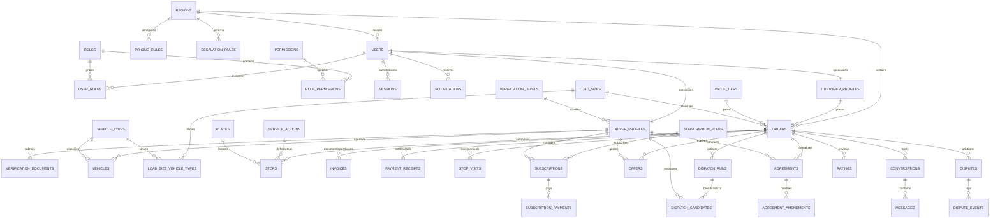
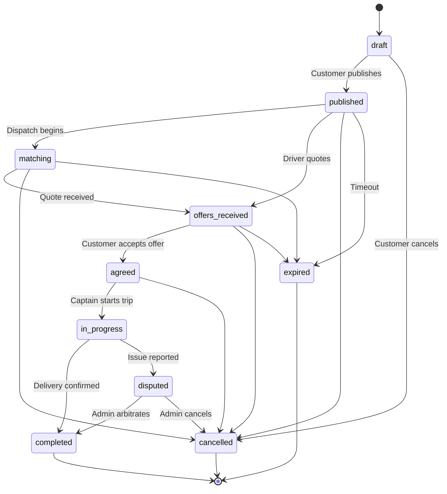
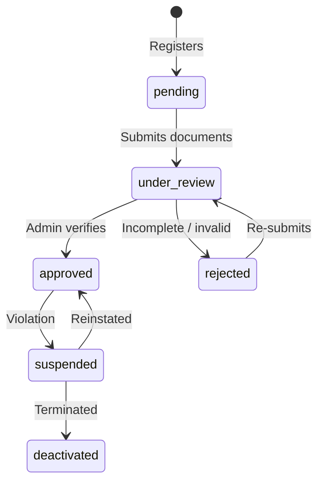

# Wasel (واصل) — Relational Data Model Specification

> **Version:** 2.0.0  
> **Target Database:** PostgreSQL 15+ with PostGIS, hosted on Supabase (Managed Postgres only)  
> **Schema Isolation:** Dedicated `app` schema with 100% RLS default-deny and PostgREST isolation  
> **Primary Region:** Giza, Egypt (Hadayek al-Ahram)  

---

## 1. Architectural Overview & Security Invariants

### 1.1 Supabase as Managed Postgres (No Direct Client Access)
Wasel treats Supabase strictly as managed infrastructure for PostgreSQL and PostGIS.
- **Zero Client Direct Access:** Web and PWA clients (Customer, Captain, Admin) never communicate directly with Supabase or PostgREST. All queries flow through the NestJS modular monolith API (`apps/api`).
- **Supabase Auth Bypassed:** Authentication is wholly self-contained in `apps/api` using phone number E.164 normalization, OTP verification, and rotating hashed JWT refresh sessions.

### 1.2 Dedicated `app` Schema & PostgREST Lockdown
All platform tables reside in the dedicated PostgreSQL schema `app`.
```sql
REVOKE ALL ON SCHEMA app FROM public, anon, authenticated;
ALTER DEFAULT PRIVILEGES IN SCHEMA app REVOKE ALL ON TABLES FROM public, anon, authenticated;
ALTER DEFAULT PRIVILEGES IN SCHEMA app REVOKE ALL ON FUNCTIONS FROM public, anon, authenticated;
ALTER DEFAULT PRIVILEGES IN SCHEMA app REVOKE ALL ON SEQUENCES FROM public, anon, authenticated;
```
Every table in `app` has Row Level Security (RLS) enabled with zero permissive policies for `anon` and `authenticated`. Even if an attacker obtains the Supabase publishable key, 100% of read and write operations return HTTP 401/403/404 or empty sets.

### 1.3 Core Conventions
| Category | Convention | Rationale |
| :--- | :--- | :--- |
| **Primary Keys** | `UUID DEFAULT extensions.gen_random_uuid()` | Cryptographically secure, non-enumerable, cluster-safe |
| **Currency / Money** | `BIGINT` minor units (`*_minor`) | Egyptian piasters (1 EGP = 100 minor). No floating-point rounding errors |
| **Spatial Coordinates** | `extensions.geography(Point, 4326)` | Accurate spherical distance calculation in meters with PostGIS GiST indexes |
| **Region Scoping** | `region_id UUID REFERENCES app.regions(id)` | Every operational record is bound to a geographic market |
| **Timestamps** | `TIMESTAMPTZ` (UTC) | Consistent audit logging, triggers via `app.set_updated_at()` |
| **Arabic Labels** | `name_ar VARCHAR NOT NULL`, `name_en` optional | Arabic-first platform design; all configurable texts reside in tables |

---

## 2. Entity-Relationship Diagrams (Mermaid)

### 2.1 Complete Relational Architecture (Master ERD)



---

## 3. Data Dictionary: Tables & Constraints

### 3.1 Identity & Foundation
- **`app.regions`**: Geographical operating markets (e.g. `hadayek_ahram`). GeoJSON boundary polygon.
- **`app.users`**: Core user accounts. Authenticates via phone (E.164 normalized), hashed passwords for admins.
- **`app.roles`**: System roles (`customer`, `driver`, `admin`, `support`).
- **`app.permissions`**: Fine-grained RBAC privilege declarations.
- **`app.user_roles`** & **`app.role_permissions`**: Associative junction tables.
- **`app.sessions`**: Device sessions with rotating hashed JWT refresh tokens.
- **`app.otp_challenges`**: Phone verification challenges with max 3 attempts and resend cooldowns.
- **`app.settings`**: Global and region-scoped dynamic configuration entries (`currency`, `max_tasks_per_order`).
- **`app.audit_logs`**: Immutable security log of modifications.
- **`app.outbox`**: Transactional outbox for guaranteed asynchronous event publishing.

### 3.2 State Machine
- **`app.status_transitions`**:
  - `(entity, from_status, to_status)` UNIQUE.
  - `allowed_roles TEXT[]`: Authorized RBAC roles capable of triggering transition.
  - Trigger function `app.guard_status_transition()` automatically verifies all updates.

### 3.3 People & Verification (Captains & Fleet)
- **`app.verification_levels`**:
  - `level_1_basic` (National ID, vehicle registration, license).
  - `level_2_verified` (Criminal background clearance / فيش جنائي).
  - `level_3_reputation` (High rating $\ge 4.8$ and $>100$ completed trips).
  - `allowed_value_tier_ids UUID[]`: Enforces driver qualification against order monetary risk.
- **`app.customer_profiles`**: Rating averages and totals for clients.
- **`app.driver_profiles`**: Operating status (`pending`, `under_review`, `approved`, `suspended`), `is_online`, `last_location` (`geography(Point, 4326)` with GiST index), `acceptance_rate`. Termed "Captain" in UI.
- **`app.vehicle_types`**: Approved vehicle classes:
  1. `bicycle` (دراجة هوائية, up to 15 kg)
  2. `motorcycle` (موتوسيكل, up to 40 kg)
  3. `tricycle` (تروسيكل, up to 400 kg)
  4. `half_truck` (نصف نقل / بيك آب, up to 1200 kg)
  5. `jumbo` (جامبو / نقل خفيف, up to 3500 kg)
- **`app.vehicles`**: Driver transport assets with Egyptian plate numbers and license photos.
- **`app.verification_documents`**: Driver submitted documents with AES-encrypted metadata and reviewer audit fields.

### 3.4 Catalog
- **`app.value_tiers`**: Order goods brackets (piasters minor units):
  - `tier_lt_200`: 0 to 20,000 minor (<200 EGP)
  - `tier_200_500`: 20,000 to 50,000 minor (200–500 EGP)
  - `tier_500_1000`: 50,000 to 100,000 minor (500–1000 EGP)
  - `tier_1000_5000`: 100,000 to 500,000 minor (1000–5000 EGP)
  - `tier_gt_5000`: 500,000 minor upwards (>5000 EGP)
- **`app.service_actions`**: Extensible stop actions (`buy`, `pick`, `drop`, `move`, `find`).
- **`app.load_sizes`**: `small`, `medium`, `large`, `bulky`.
- **`app.load_size_vehicle_types`**: Compatibility matrix mapping load sizes to vehicle classes.
- **`app.places`**: Points of interest with PostGIS location and trigram search index on Arabic names.

### 3.5 Orders & Execution
- **`app.orders`**: Order aggregate root. Contains `customer_location`, `wait_mode` (`wait` vs `notify`), `min_fare_minor`, lifecycle status, and cancellation reasons.
  - Trigger `app.check_max_stops_per_order()` strictly limits stops to setting `max_tasks_per_order` (default 8).
- **`app.stops`**: Waypoint tasks with sequence `seq`, target location, and expected duration.
- **`app.stop_visits`**: Physical arrival and departure timestamps per stop.
- **`app.invoices`**: Merchant receipts paid by driver for goods purchases.
- **`app.payment_receipts`**: Records cash settled directly between customer and captain upon order completion.

### 3.6 Pricing & Calculations
- **`app.pricing_rules`**: Region fees:
  - `stop_fee_minor`: 1,000 minor (10 EGP)
  - `wait_fee_per_hour_minor`: 3,500 minor (35 EGP/hr)
  - `goods_percent_rate`: 0.1000 (10%)
- **`app.fare_calculations`**: Snapshot history of calculated fares.

### 3.7 Matching & Subscriptions
- **`app.subscription_plans`**: Driver tiers (`trial_30d` for 0 EGP, `monthly_standard` for 150 EGP).
- **`app.subscriptions`**: Captain memberships.
- **`app.v_driver_active_subscription`**: View filtering captains with currently active, non-expired subscriptions.
- **`app.escalation_rules`**: Expansion radii (2km $\to$ 3km $\to$ 4km $\to$ 7km) and timeouts (45s).
- **`app.dispatch_runs`** & **`app.dispatch_candidates`**: Active dispatch broadcast state.

### 3.8 Agreements, Trust & Communication
- **`app.offers`**: Driver quotations.
- **`app.agreements`**: Binding delivery agreement.
  - **Constraint:** Partial unique index `(order_id) WHERE status = 'active'` ensures exactly one active agreement per order.
  - **Trigger:** `app.enforce_agreement_immutability()` prevents any modification to terms or snapshot once `locked_at` is set.
- **`app.agreement_amendments`**: Formal mid-trip changes.
- **`app.conversations`** & **`app.messages`**: In-app chat.
- **`app.ratings`**: Reviews updating profile averages via trigger `app.update_profile_rating_aggregates()`.
- **`app.disputes`** & **`app.dispute_events`**: Administrative dispute resolution.
- **`app.order_tracking_points`**: Real-time GPS breadcrumbs.

---

## 4. Business Logic & Calculation Formulas

### 4.1 Billable Visits Counting (`app.count_billable_visits`)

#### The Customer Point Rule:
> **Rule:** The customer's location counts as **one billable visit only when it has an explicit task** (`pick`, `drop`, etc.), counted **once regardless of repeats**. The implicit final delivery to the customer is **not billable**.

#### Deduplication & Multi-Visit Rules:
1. Every distinct merchant/place where the driver performs tasks counts as **1 visit**.
2. Multiple tasks at the same place in immediate succession count as **1 visit**.
3. If the driver departs and returns to the same place (recorded as distinct sequences in `stop_visits`), it counts as **2 visits**.

---

### 4.2 Fare Formulas

$$\text{Final Fare} = (\text{Visits} \times \text{StopFee}) + (\text{WaitHours} \times \text{WaitFee}) + (\text{GoodsPercent} \times \sum \text{Invoices})$$

$$\text{Min Fare} = (\text{Visits} \times \text{StopFee}) + (\text{ExpectedWaitHours} \times \text{WaitFee}) + (\text{GoodsPercent} \times \text{Tier.Min})$$

*Default rates for Hadayek al-Ahram:*
- $\text{StopFee} = 10\text{ EGP}$ (1,000 minor)
- $\text{WaitFee} = 35\text{ EGP/hour}$ (3,500 minor)
- $\text{GoodsPercent} = 10\%$ ($0.1000$)

---

### 4.3 Worked Examples

#### Scenario (a): Single Store Purchase Order (160 EGP Invoice)
- **Stops:** 1 stop at grocery store (`buy`). Implicit final delivery to customer.
- **Visit Count:** Store = 1. Customer point = 0 (no explicit task). $\text{Total Visits} = 1$.
- **Calculation:**
  $$\text{Fare} = (1 \times 10) + (0 \times 35) + (10\% \times 160) = 10 + 0 + 16 = \mathbf{26\text{ EGP}}\;(2,600\text{ minor})$$

#### Scenario (b): Shoe Repair (Home Pick + Tailor + Home Drop, 2h Wait, 100 EGP Invoice)
- **Stops:**
  - Stop 1: Customer home (`pick` shoes).
  - Stop 2: Tailor shop (`buy`/repair, 120 min wait).
  - Stop 3: Customer home (`drop` repaired shoes).
- **Visit Count:** Customer home has explicit tasks $\to$ counts once $= 1$. Tailor shop $= 1$. $\text{Total Visits} = 2$.
- **Calculation:**
  $$\text{Fare} = (2 \times 10) + (2 \times 35) + (10\% \times 100) = 20 + 70 + 10 = \mathbf{100\text{ EGP}}\;(10,000\text{ minor})$$

#### Scenario (c): Two Tasks at Same Store
- **Stops:** Stop 1 (`buy` groceries at supermarket), Stop 2 (`pick` parcel at same supermarket).
- **Visit Count:** Driver does not leave and return $\to \mathbf{1\text{ visit}}$.

#### Scenario (d): Leave and Return
- **Stops:** Stop 1 at pharmacy, driver visits dry cleaner, then returns to pharmacy (Stop 3).
- **Visit Count:** Two separate arrivals recorded in `stop_visits` $\to \mathbf{2\text{ visits}}$.

---

## 5. State Machine Lifecycle Graphs

### 5.1 Order Lifecycle



### 5.2 Captain Verification Lifecycle



---

## 6. Spatial Driver Matching (`app.find_eligible_drivers`)

The PostGIS matching query guarantees sub-50ms execution on candidate pools using a multi-stage indexed filter:
1. **Spatial Filtering:** `ST_DWithin(dp.last_location, order.customer_location, radius_meters)` using GiST spatial indexing.
2. **Online & Approved Status:** Indexed filter on `(is_online, status) WHERE is_online = true AND status = 'approved'`.
3. **Active Subscription:** `JOIN app.v_driver_active_subscription` confirms valid unexpired membership.
4. **Verification Tier Gating:** `vl.allowed_value_tier_ids` must include the order's `value_tier_id`.
5. **Vehicle Capacity Matching:** Vehicle class must satisfy the order's `load_size_id` (or higher `escalation_rank` if vehicle escalation is triggered).
6. **Ranking:** Results ordered by spherical distance ascending:
   $$\text{Distance} = \text{ST\_Distance}(dp.last\_location, order.customer\_location)$$

---

## 7. Migration & Seed Manifest

| File | Purpose | Environment |
| :--- | :--- | :--- |
| `20261004000001_foundation_and_extensions.sql` | PostGIS, Citext, Pgcrypto, schema `app`, base identity tables | All |
| `20261004000002_state_machine.sql` | `status_transitions` table & `guard_status_transition()` | All |
| `20261004000003_people_and_verification.sql` | Profiles, verification levels, vehicle types, fleet assets | All |
| `20261004000004_catalog.sql` | Value tiers, service actions, load sizes, places | All |
| `20261004000005_orders_and_invoices.sql` | Orders, stops, stop visits, invoices, receipts, max stops trigger | All |
| `20261004000006_pricing_and_calculations.sql` | Pricing rules, fare calculations, `count_billable_visits`, fare functions | All |
| `20261004000007_subscriptions_and_matching.sql` | Subscriptions, plans, escalation rules, `find_eligible_drivers` | All |
| `20261004000008_offers_and_agreements.sql` | Offers, agreements, locked snapshot immutability trigger | All |
| `20261004000009_communication_trust_tracking.sql` | Chat, ratings trigger, disputes, notifications, live tracking | All |
| `20261004000010_final_security_and_verification.sql` | Default privileges revoke, `verify_rls_and_permissions()` audit | All |
| `supabase/seed.sql` | Production reference data (no synthetic users/captains) | All |
| `supabase/seed.dev.sql` | 50 synthetic captains clustered around Hadayek al-Ahram | Local / Staging |
| `supabase/tests/data_model.spec.sql` | PL/pgSQL automated regression test suite | Test / Staging |
| `scripts/verify-rls.ts` | Zero-trust publishable key denial verification script | CI / Staging |
