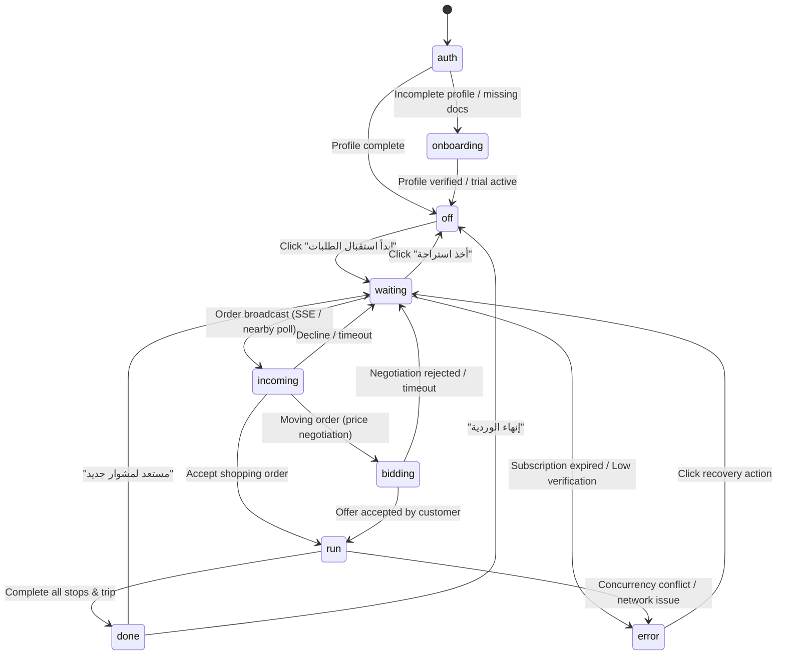

# Wasel Driver PWA (تطبيق الكابتن - واصل)

## Overview & UX Principles
Wasel Driver PWA (`apps/driver-web`, Arabic UI term "كابتن", code term `driver`) is designed specifically for captains operating in Hadayek al-Ahram, Giza, Egypt. Captains work outdoors under bright sunlight, one-handed, on mid-range Android devices with unreliable cellular connections.

### Key UX Directives
1. **Single Map Screen with Bottom Sheet**: The entire driver experience is driven from a single persistent map screen with an interactive bottom sheet managed by an explicit finite state machine.
2. **One Primary Action Button ($\ge 56\text{px}$)**: In every phase of execution, there is strictly one primary bottom-anchored action button with a minimum touch target of $56\text{px}$, easily reachable with the thumb.
3. **Arabic-First RTL with Cairo Font**: Designed natively for RTL Arabic reading with tokens from `@wasel/shared`.
4. **Sunlight-Readable Theme**: Features a high-contrast sunlight theme (`[data-theme="sunlight"]`) alongside light and dark modes.
5. **No Competition with the Task**: Profile, verification documents, subscription details, and shift earnings are housed inside a single drawer menu that is hidden while an active trip is running.
6. **No Client-Side Fare Calculations**: The client never computes prices or formulas. Minimum fare is displayed prominently before acceptance; settlement breakdown is received directly from the API upon trip completion.

---

## State Machine Architecture
The driver app UI is governed by a pure deterministic finite state machine (`apps/driver-web/src/machines/driverStateMachine.ts`):



### Run Phase Stop Sub-Machine
Within the `run` state, each stop progresses through strict causal sub-phases:
1. `to_stop`: Captain is driving to the stop. Primary button: `📍 وصلت للمحطة (تسجيل وصول)`.
2. `at_stop`: Captain arrived.
   - If waiting mode was selected by customer: Captain can click `⏱️ بدء عداد الانتظار`.
   - If invoice is required: Primary action opens camera modal: `🧾 إصدار وتصوير فاتورة المتجر`.
   - If no invoice is required: Short path: `✓ إكمال المحطة والانتقال للتالية`.
3. `waiting`: Waiting elapsed timer is active on screen until captain clicks `إنهاء الانتظار وتسجيل المغادرة`.
4. `invoice_entry`: Captures amount in EGP, invoice receipt number, and camera photo (compressed on client to $\le 1280\text{px}$).
5. `payment_pending`: Invoices recorded, ready for cash settlement confirmation.
6. `stop_completed`: Advances `currentStopIndex` to the next stop or triggers final trip completion.

---

## Resilience & Offline Architecture

### 1. Offline Action Queue (IndexedDB + LocalStorage Fallback)
Network drops are common outdoors. The offline queue (`src/services/storage/offlineQueue.ts`) ensures zero lost actions:
- Every action is assigned a stable client UUID `Idempotency-Key`.
- Actions are stored in IndexedDB (object store `wasel_driver_actions`) with a synchronous `localStorage` fallback.
- Optimistic UI updates keep the driver moving without interface freezes.
- When network reconnects (`window.addEventListener('online')`), actions replay in **strict FIFO causal order**.
- If an upstream action fails with a network or server error, downstream replay halts immediately to preserve sequence integrity.
- Completed actions are purged only after positive acknowledgment from the API.

### 2. PWA Background & Tracking Realities
PWAs on mobile operating systems have strict background lifecycle constraints:
- **Screen Wake Lock API**: When entering the `run` state, `requestScreenWakeLock()` is acquired to prevent the device screen from sleeping during active delivery trips.
- **Background Limitation**: Mobile operating systems (especially iOS WebKit) suspend JavaScript execution and throttle `navigator.geolocation.watchPosition` when the PWA is minimized or placed in the background.
- **Graceful Degradation**:
  - The UI clearly displays an indicator: "ابقِ التطبيق مفتوحاً على الشاشة لاستقبال الطلبات".
  - On `document.visibilitychange` from hidden to visible, buffered location points are flushed and the wake lock is re-acquired.
  - Device coordinates are captured on stop arrival and verified against geofence thresholds on the server. If GPS fails or is unavailable, manual confirmation is permitted with a `location_mismatch` flag instead of blocking the captain.

### 3. Web Push Notifications
- Web Push subscription is requested **only after the first successful online session** (`GO_ONLINE`), avoiding prompt fatigue on initial install.
- Standalone PWA installation is checked on iOS before requesting notification permission.
- Incoming push notifications deep-link directly to the incoming order sheet.

---

## Security & Engineering Guardrails

### 1. Zero Production Test Backdoors
Any test backdoor, such as `?test_session=true` or query state overrides, is wrapped strictly inside:
```ts
if (import.meta.env.MODE === 'test') {
  // Only bundled in test mode; dead-code-eliminated in production
}
```
Vite's production build evaluates `import.meta.env.MODE === 'test'` as `false` and Rollup tree-shakes the code. This is verified by `tests/no-backdoors.spec.ts`.

### 2. Performance Budgets
- **Initial JS Bundle**: $\le 150\text{ KB}$ gzip (excluding the lazy-loaded map library). Current production bundle size: **136.08 KB gzip**.
- **Map Lazy-Loading**: MapLibre GL is split into an asynchronous dynamic chunk (`React.lazy`), accompanied by a lightweight loading skeleton.
- **Lighthouse Mobile Emulation**:
  - Performance: $\ge 85$
  - Largest Contentful Paint (LCP): $\le 2.5\text{ s}$
  - Accessibility: $\ge 95$
  - Best Practices: $\ge 90$

### 3. Error Taxonomy
Every backend error code is mapped to a clear Arabic message and exactly one recovery action (`src/services/errors/errorTaxonomy.ts`):
- `ORDER_ALREADY_AGREED` $\rightarrow$ "تم قبول هذا المشوار مسبقاً من كابتن آخر في سباق التنافس." + Action: "العودة لانتظار الطلبات".
- `SUBSCRIPTION_REQUIRED` $\rightarrow$ "عذراً، يتطلب استقبال وقبول المشاوير وجود اشتراك نشط للكابتن." + Action: "الاشتراك الآن".
- `VERIFICATION_LEVEL_TOO_LOW` $\rightarrow$ "مستوى توثيق حسابك الحالي لا يسمح بقبول هذه الفئة المالية من الطلبات." + Action: "ترقية التوثيق".
- `AGREEMENT_IMMUTABLE` $\rightarrow$ "بنود الاتفاق الحالي مغلقة نهائياً ومحمية من التعديل المباشر." + Action: "مراجعة الملحق".
